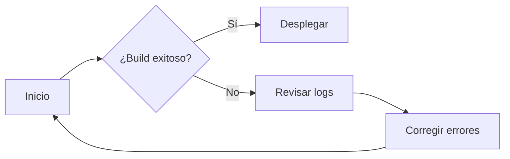

# Pruebas: Índice

Breve página de prueba para verificar que MkDocs renderiza metadatos, mermaid, bloques de código y otros elementos.

## Contenido rápido

- Mermaid
- Bloques de código (bash, python, yaml, html)
- Tablas, listas y admoniciones
- Ejemplos de front-matter y enlaces

## Mermaid (diagrama de flujo)



## Código de ejemplo

Bash (iniciar servidor local):

```bash
# instalar dependencias y servir
pip install mkdocs mkdocs-material
mkdocs serve
```

Python (fragmento de ejemplo):

```python
def saludo(nombre: str) -> str:
        return f"Hola, {nombre}!"

print(saludo("MkDocs"))
```

Fragmento YAML (porciones de mkdocs.yml):

```yaml
site_name: "Mi Sitio de Pruebas"
theme:
    name: "material"
plugins:
    - search
    - mermaid2
nav:
    - Home: index.md
```

HTML embebido (solo prueba):

```html
<div class="demo-box">
    <strong>Nota:</strong> contenido HTML en Markdown.
</div>
```

## Admoniciones

!!! note
    Esto es una nota de ejemplo usando la sintaxis de admonición (compatible con MkDocs Material).


!!! warning
    Advertencia: comprueba que el plugin de mermaid esté habilitado si no ves los diagramas.


## Tabla y listas

| Característica | Estado |
|---|---:|
| Mermaid | ✓ |
| Bloques de código | ✓ |
| Front-matter | ✓ |
| Imágenes | opcional |

Lista de verificación:

- [x] Lorem ipsum dolor sit amet, consectetur adipiscing elit
- [ ] Vestibulum convallis sit amet nisi a tincidunt
    * [x] In hac habitasse platea dictumst
    * [x] In scelerisque nibh non dolor mollis congue sed et metus
    * [ ] Praesent sed risus massa
- [ ] Aenean pretium efficitur erat, donec pharetra, ligula non scelerisque

## Enlaces y recursos

- Documentación MkDocs: https://www.mkdocs.org/
- Plugin mermaid (si aplica): https://github.com/brandon-rhodes/mermaid

## Notas finales

Inline code: `mkdocs build` — enfatizado *rápido* y **visible**.


<!-- imagen de ejemplo (ruta relativa) -->

