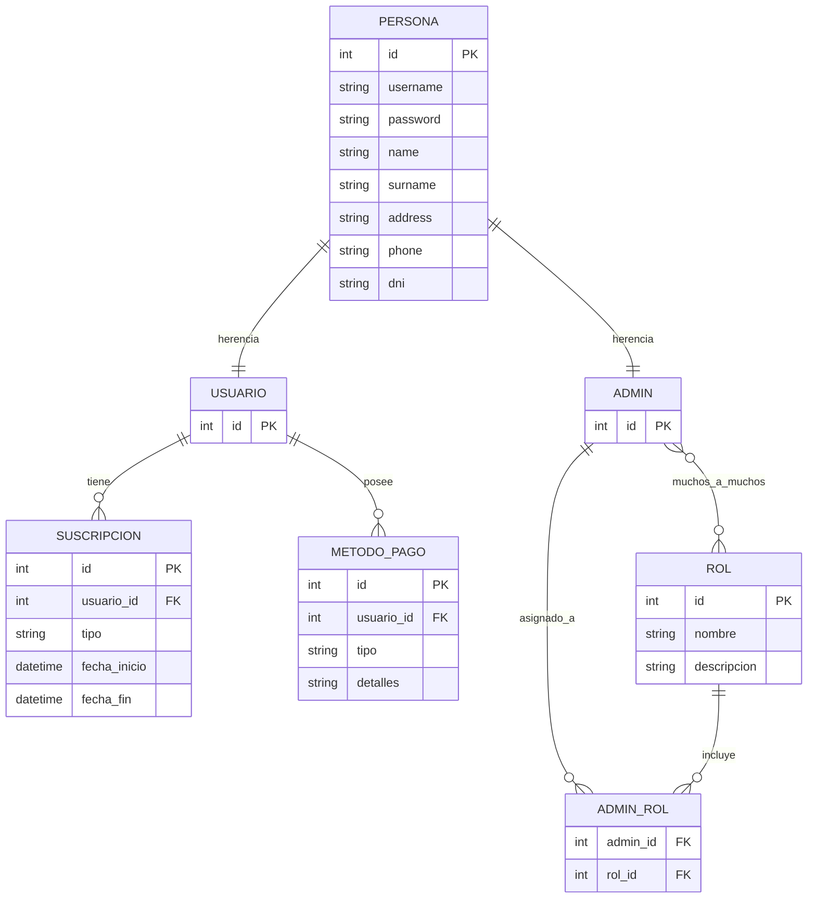
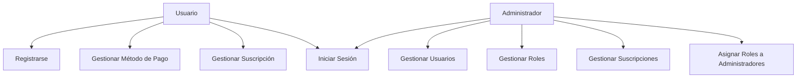

## Diagrama E-R

```mermaid
erDiagram
    PERSONA {
        int id PK
        string username
        string password
        string name
        string surname
        string address
        string phone
        string dni
    }

    ADMIN {
        int id PK
    }

    USUARIO {
        int id PK
    }

    SUSCRIPCION {
        int id PK
        int usuario_id FK
        string tipo
        datetime fecha_inicio
        datetime fecha_fin
    }

    METODO_PAGO {
        int id PK
        int usuario_id FK
        string tipo
        string detalles
    }

    ROL {
        int id PK
        string nombre
        string descripcion
    }

    ADMIN_ROL {
        int admin_id FK
        int rol_id FK
    }

    PERSONA ||--|| ADMIN : "herencia"
    PERSONA ||--|| USUARIO : "herencia"

    USUARIO ||--o{ SUSCRIPCION : "tiene"
    USUARIO ||--o{ METODO_PAGO : "posee"

    ADMIN ||--o{ ADMIN_ROL : "asignado_a"
    ROL ||--o{ ADMIN_ROL : "incluye"
    ADMIN }o--o{ ROL : "muchos_a_muchos"
```

# Diagrama CU

```mermaid
graph TD

    UC1[Registrarse]
    UC2[Gestionar Método de Pago]
    UC3[Gestionar Suscripción]
    UC4[Iniciar Sesión]
    UC5[Gestionar Usuarios]
    UC6[Gestionar Roles]
    UC7[Gestionar Suscripciones]
    UC8[Asignar Roles a Administradores]

    Usuario --> UC1
    Usuario --> UC2
    Usuario --> UC3
    Usuario --> UC4

    Administrador --> UC4
    Administrador --> UC5
    Administrador --> UC6
    Administrador --> UC7
    Administrador --> UC8
```

## Endpoints